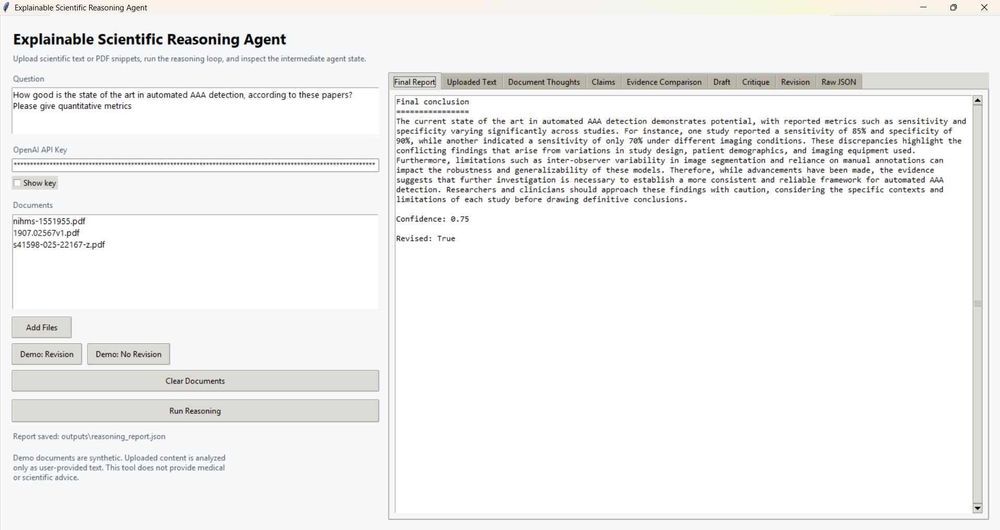

# Explainable Scientific Reasoning Agent

A Python 3.11+ CLI and desktop GUI demo for multi-document scientific reasoning over scientific documents.

The project reads scientific documents, extracts key claims, compares evidence across documents, detects conflicts, tracks uncertainty, drafts a conclusion, critiques that conclusion, revises it when needed, and produces an explainable JSON report. The GUI lets users upload their own `.txt` or `.pdf` documents and inspect what the agent thinks at each intermediate step.

## GUI Preview



## Disclaimer

All included documents are synthetic demo data about a fictional oncology treatment called Therapy X for fictional Cancer Y. They are not real medical or scientific evidence. This project is for software demonstration only and is not medical, scientific, clinical, or research advice.

## Why This Is Different From RAG

This is not a generic retrieval-augmented generation chatbot. The demo does not simply retrieve document text and ask a model to answer from it. Instead, it makes the reasoning process explicit:

- extracts claims from each document
- separates evidence for and against the question
- detects conflicts across studies
- tracks uncertainty and limitations
- drafts an answer
- critiques the answer for overclaiming and omissions
- revises the conclusion when the critique finds problems
- emits an audit trail and explainability report

## Workflow

```text
load_documents
  -> extract_claims
  -> compare_evidence
  -> draft_conclusion
  -> critique_conclusion
  -> [revision_needed?]
       -> yes: revise_conclusion
       -> no:  use draft conclusion
  -> final_explainable_report
```

The workflow is implemented with the LangGraph library. Each reasoning step is a graph node, and the critique step uses a conditional edge to decide whether to run revision or use the draft as the final conclusion.

## Critique Loop

The critic checks whether the draft conclusion:

- overstates the evidence
- ignores conflicting findings
- omits limitations
- fails to mention subgroup-specific evidence
- assigns too much confidence

If any critique list is non-empty, `revision_needed` is set to `true` and the workflow runs `revise_conclusion`. The revised conclusion is expected to be more cautious, more explicit about uncertainty, and better aligned with the evidence comparison.

## Explainability Report

The final report is saved to `outputs/reasoning_report.json` and includes:

- the question
- final conclusion
- confidence level
- evidence for
- evidence against
- conflicts detected
- uncertainty sources
- critique of the initial answer
- audit trail with documents loaded, claims extracted, workflow steps, and LLM usage categories

## Setup

```bash
python -m venv venv
source venv/bin/activate
pip install -r requirements.txt
cp .env.example .env
```

On Windows PowerShell, activate the environment with:

```powershell
.\venv\Scripts\Activate.ps1
```

Add your OpenAI API key to `.env` if you want live LLM-backed JSON outputs:

```text
OPENAI_API_KEY=your_api_key_here
```

If no API key is present, the project falls back to deterministic local mock outputs so the demo still runs.

You can also enter an OpenAI API key directly in the GUI. Keys entered in the GUI are used for the current app session and are not written to `.env`.

## Run

Launch the GUI:

```bash
python gui.py
```

In the GUI, you can:

- add your own `.txt` documents
- add PDFs with extractable text
- run the built-in revision-needed demo
- run the built-in no-revision-needed demo
- edit the scientific question
- enter an OpenAI API key for live LLM-backed reasoning
- preview uploaded or extracted document text
- run the reasoning workflow
- inspect document-level agent thoughts, extracted claims, evidence comparison, draft, critique, revision, and raw JSON

PDF support uses `pypdf` to extract embedded text. Scanned image-only PDFs may show no extractable text and are a good candidate for a future OCR extension.

The no-revision demo runs in deterministic demo mode so it consistently demonstrates the `revision_needed = false` branch even if an API key is entered.

Run the CLI:

```bash
python main.py --question "Does Therapy X show convincing evidence of benefit in Cancer Y?"
```

You can also run with the default question:

```bash
python main.py
```

The CLI prints:

- final conclusion
- confidence
- evidence for
- evidence against
- conflicts
- uncertainty sources
- whether revision was needed

The full JSON report is saved to:

```text
outputs/reasoning_report.json
```

## Project Structure

```text
explainable-scientific-reasoning-agent/
  documents/
    demo_set_01/
      doc_01.txt
      doc_02.txt
      doc_03.txt
      doc_04.txt
    demo_set_02_no_revision/
      demo_no_revision_01.txt
  agent/
    __init__.py
    loader.py
    claim_extractor.py
    evidence_comparator.py
    drafter.py
    critic.py
    reviser.py
    reporter.py
    workflow.py
  outputs/
  gui.py
  main.py
  requirements.txt
  README.md
  .env.example
  .gitignore
```

## Future Extensions

- richer paper ingestion with metadata, section parsing, tables, figures, and OCR for scanned PDFs
- PubMed/arXiv retrieval
- citation-aware evidence tracking
- graph checkpointing, resume, and streaming with LangGraph
- memory across reasoning sessions

## License

MIT License

Copyright (c) 2026 vdeeplearning

Permission is hereby granted, free of charge, to any person obtaining a copy
of this software and associated documentation files (the "Software"), to deal
in the Software without restriction, including without limitation the rights
to use, copy, modify, merge, publish, distribute, sublicense, and/or sell
copies of the Software, and to permit persons to whom the Software is
furnished to do so, subject to the following conditions:

The above copyright notice and this permission notice shall be included in all
copies or substantial portions of the Software.

THE SOFTWARE IS PROVIDED "AS IS", WITHOUT WARRANTY OF ANY KIND, EXPRESS OR
IMPLIED, INCLUDING BUT NOT LIMITED TO THE WARRANTIES OF MERCHANTABILITY,
FITNESS FOR A PARTICULAR PURPOSE AND NONINFRINGEMENT. IN NO EVENT SHALL THE
AUTHORS OR COPYRIGHT HOLDERS BE LIABLE FOR ANY CLAIM, DAMAGES OR OTHER
LIABILITY, WHETHER IN AN ACTION OF CONTRACT, TORT OR OTHERWISE, ARISING FROM,
OUT OF OR IN CONNECTION WITH THE SOFTWARE OR THE USE OR OTHER DEALINGS IN THE
SOFTWARE.
